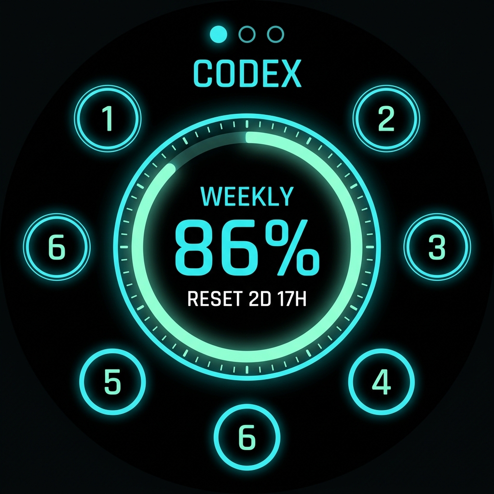
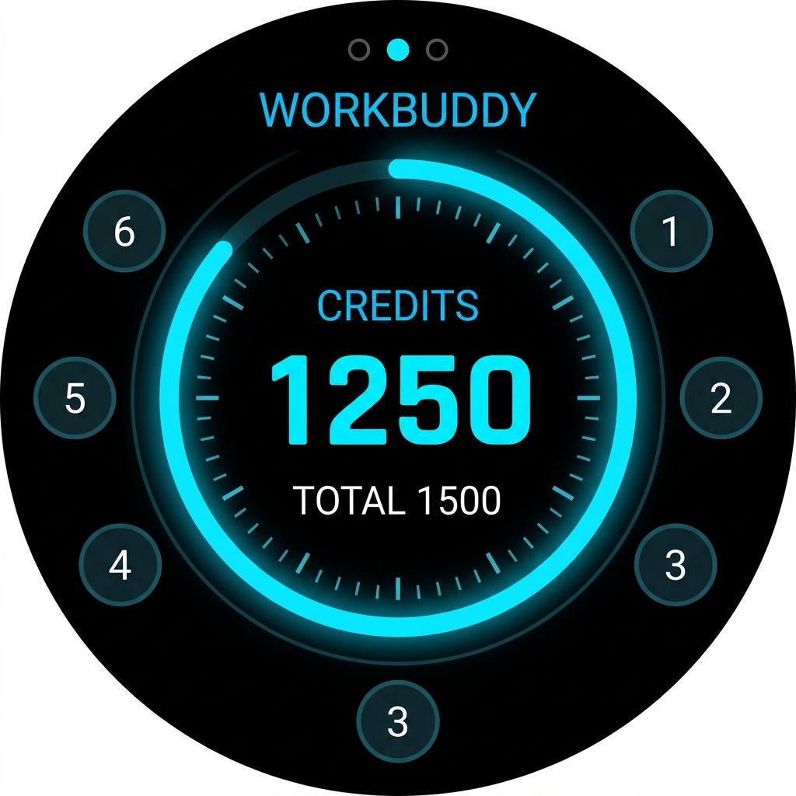
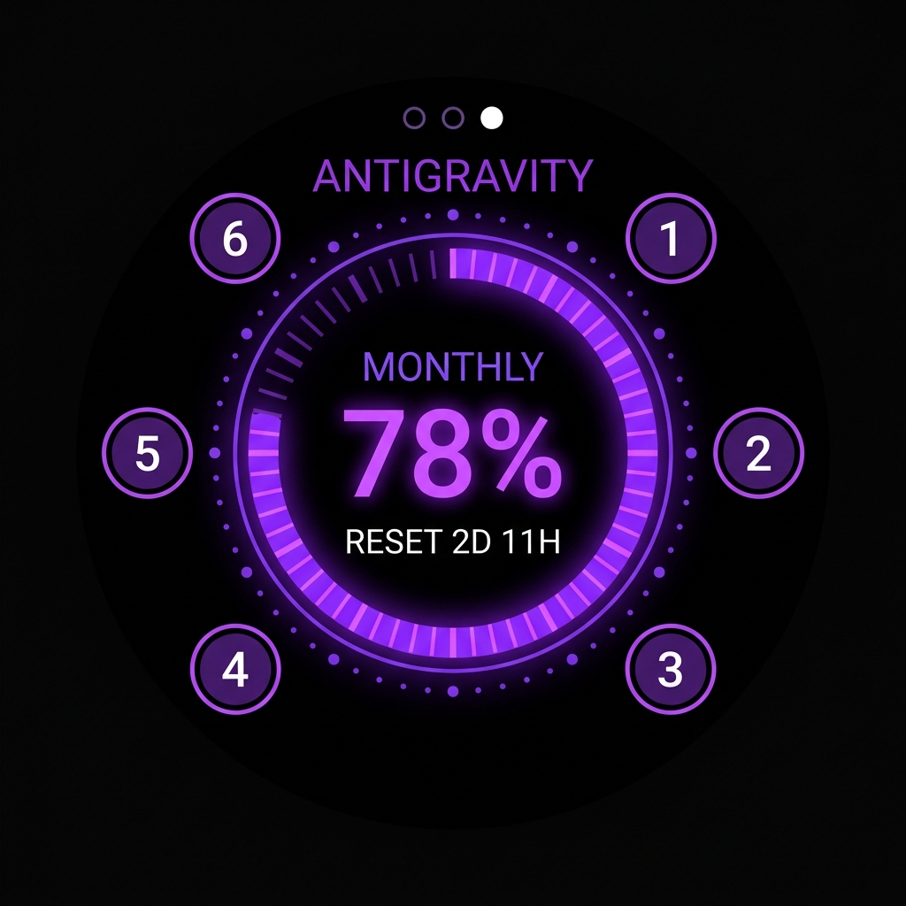
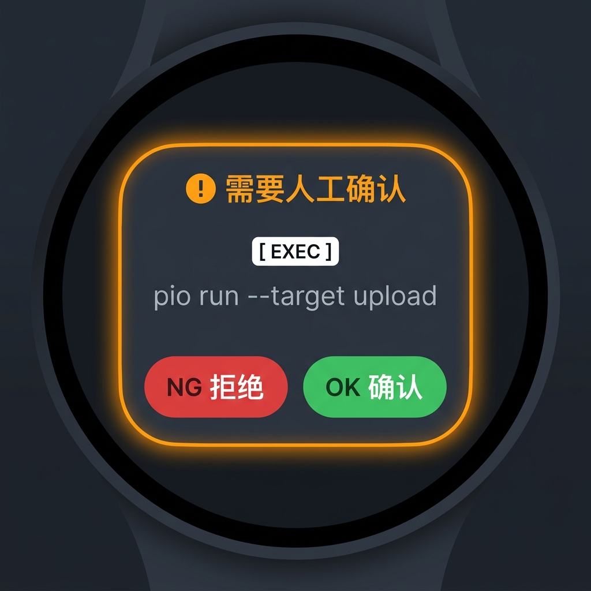

# VibeWatch (随身 AI 编程智能体中枢)

[English](README.md) | **简体中文**

[](https://platformio.org/)
[](https://swift.org/)
[](tests/)
[](LICENSE)

**专为 Vibe Coding 与多智能体并行编程打造的随身触控硬件中枢 — 基于 M5Stack StopWatch (ESP32-S3 AMOLED)。**

---

## 🌟 核心特性 (Key Features)

### 1. 三大桌面 AI 智能体全功能支持 (Tri-Agent Dashboard)
通过横向滑动手势，在三大顶尖桌面编程智能体之间自由切换，每个智能体享有完全独立的数据模型、品牌主题色与遥测面板：

<table>
  <tr>
    <td width="33%" align="center">
      <br>
      <strong>🟢 1. OpenAI Codex</strong><br>
      薄荷青主题 · 周度配额百分比 · 实时重置倒计时
    </td>
    <td width="33%" align="center">
      <br>
      <strong>🔵 2. 腾讯 Workbuddy</strong><br>
      极光蓝主题 · 专属 Credit 点数余额 · 额度总览
    </td>
    <td width="33%" align="center">
      <br>
      <strong>🟣 3. Google Antigravity</strong><br>
      星系紫主题 · 月度配额与上下文监控
    </td>
  </tr>
</table>

- **手势无缝切页**：向左/向右滑动屏幕即可流畅切卡，伴随清脆的 **1150Hz 切页音效** 与 **触觉轻震**。
- **状态持久化 (NVS Memory)**：重启或断电后自动恢复停留在上次选定的智能体卡片。
- **任务隔离机制**：三张卡片的 6 智能体环、按住说话 HID 控制事件与审批事件各自携带上下文标识（如 `"c": "WORKBUDDY"`），杜绝跨系统串扰；手表不采集麦克风音频。

---

### 2. 人工介入审批与防抢占保护 (Human-in-the-Loop Approval)

在 AI 智能体执行敏感操作（读取文件、运行终端命令、执行脚本）需要人工授权时，VibeWatch 会瞬间接管：

<p align="center">
  <br>
  <em>当智能体需要确认时触发的醒目安全弹窗</em>
</p>

- **强提醒与自动定向切页**：自动唤醒屏幕、定向切至对应智能体卡片，伴随双重震动警报与 1250Hz 和弦提示音。
- **操作类型与描述展示**：清晰显示 `[ EXEC ]`、`[ SCRIPT ]`、`[ WRITE ]` 及安全的 UTF-8 中文描述文本。
- **物理实体按键盲操**：
  - 👉 **右键 (BtnB) / 屏幕右半区**：一键 **OK (确认/执行)**
  - 👈 **左键 (BtnA) / 屏幕左半区**：一键 **NG (拒绝/取消)**
- **4.0 秒防抢占保护窗 (`Anti-Flapping`)**：用户在做决策期间，后台新消息不会暴力打断或跳页，保证决策连贯性。

---

### 3. 六子任务环形槽位 & 按住说话控制 (6-Agent Ring & Push-to-Talk)
- **6 环形槽位**：围绕 AMOLED 表盘分布 6 个子任务节点，通过脉冲呼吸灯直观展示各子任务的运行/闲置/完成状态。
- **中心 PTT 控制**：长按中心区域（或长按右侧物理按键）会向当前智能体发送按住说话 HID 控制事件。本固件不采集或传输麦克风音频。

---

### 4. DVFS 动态调频与极致能耗优化 (Power Optimization)
- **活跃交互状态**：锁定 **`240MHz`**，确保 60FPS 丝滑动画与亚毫秒级蓝牙响应。
- **60 秒降亮度**：平滑降频至 **`160MHz`**，有效抑制发热。
- **180 秒息屏待机**：深度降频至 **`80MHz`**，**降低约 65% 的待机功耗**，轻触屏幕即刻无感恢复全速。

---

## 🛠️ 硬件与系统架构 (Hardware & Architecture)

| 部件 | 规格 / 角色 |
| :--- | :--- |
| **主控设备** | [M5Stack StopWatch](https://docs.m5stack.com/en/core/StopWatch) (ESP32-S3, 16MB Flash, 8MB PSRAM) |
| **显示屏幕** | 1.43 英寸 466 × 466 圆形 AMOLED 电容式触控屏 |
| **交互输入** | 2 × 物理按键 (左 BtnA / 右 BtnB) + 实体振动马达 + 蜂鸣扬声器 |
| **无线通信** | Bluetooth Low Energy 5.0 (BLE HID Keyboard + 专属 GATT 遥测通道) |
| **主机支持** | macOS / Linux / Windows 智能体工作站 |

---

## 💻 快速上手与烧录 (Getting Started)

### 1. 固件编译与烧录

本项目使用 [PlatformIO](https://platformio.org/) 进行管理。将 M5Stack StopWatch 通过 USB-C 数据线连接至电脑：

```bash
# 1. 克隆代码仓库
git clone https://github.com/neilshare/vibewatch.git
cd vibewatch

# 2. 编译并烧录固件至手表
platformio run -e m5stack-stopwatch --target upload
```

---

### 2. 蓝牙配对与使用

1. 点击表盘左下角的 **设置 (Settings)** 图标进入设置菜单。
2. 选择设备槽位（如 Slot 1），点击 **PAIR** 开启配对广播。
3. 打开 Mac 蓝牙设置，连接名为 `Vibe Watch #1` 的蓝牙设备。
4. 妥善保存该设备在本机上的 CoreBluetooth UUID。下面每一个真实写入命令都必须把准确值作为 `YOUR_COREBLUETOOTH_UUID` 传入，且不要提交到代码仓库。

---

### 3. 主机端遥测与同步 (Companion & CLI)

#### 原生 macOS Swift 伴侣工具 (推荐)
已为 macOS 编写了基于原生 CoreBluetooth 的伴侣工具，即使已作为 HID 键盘连接也能实现即时 GATT 写入：

```bash
swift build --package-path companion -c release

# 仅用于演示的发现模式：广泛发现附近手表，写入合成额度，
# 并在 stderr 报告所选 CoreBluetooth UUID
./companion/.build/release/codex-watch-companion --demo --verbose

# 把真实 Codex 额度同步到准确绑定的手表
./companion/.build/release/codex-watch-companion --auto --card codex \
  --device-id YOUR_COREBLUETOOTH_UUID

# 把手动 Workbuddy Credit 数据写入同一块手表
./companion/.build/release/codex-watch-companion \
  --remaining 83.3 --reset 0 --card workbuddy \
  --credits 1250 --total-credits 1500 \
  --device-id YOUR_COREBLUETOOTH_UUID

# 发起带请求 ID 关联的 v2 审批
./companion/.build/release/codex-watch-companion --approval \
  --card workbuddy --type SCRIPT --summary "执行自动化测试脚本" \
  --device-id YOUR_COREBLUETOOTH_UUID
```

#### Python 同步脚本
```bash
# 使用运行 CLI 的同一个 Python 安装实际依赖
python3 -m pip install bleak pytest

# 运行自动化单元测试
python3 -m pytest tests/

# 通过默认原生后端同步真实 Codex 额度
python3 scripts/sync_watch.py --auto --device-id YOUR_COREBLUETOOTH_UUID

# 显式使用 Python/Bleak 发送 v2 审批
python3 scripts/sync_watch.py --backend bleak --approval \
  --summary "执行自动化测试脚本" \
  --device-id YOUR_COREBLUETOOTH_UUID
```

只有演示发现模式允许不绑定设备，而且它始终写入合成数据；真实命令不会按显示名称选择设备。详细信息请参阅[伴侣工具指南](companion/README.md)、权威的[协议 v2 文档](docs/COMPANION_PROTOCOL.md)和 [v1.01 发布说明](docs/release-notes-v1.01.md)。

---

## 📜 许可证 (License)

本项目采用 [MIT License](LICENSE) 开源许可证。
